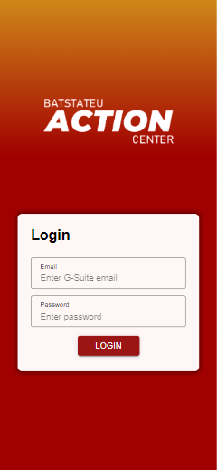
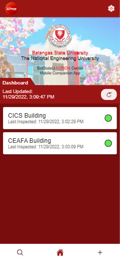
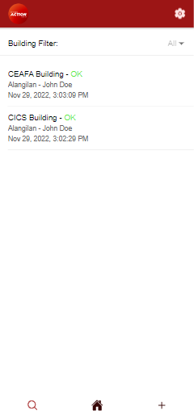

# BatStateU ACTION Center Companion App

## Screenshots

  

## Feature List (To-do):

- [x] Interface login system with the [action-api backend](https://github.com/Xapier14/action-api).
- [x] Reports
  - [x] Fetching
  - [x] Detail View
  - [x] Filtering
  - [x] Creation
- [x] Attachments
  - [x] Upload
  - [x] View
- [x] Local Feed
- [x] Mini Dashboard
  - [x] Building detail view
